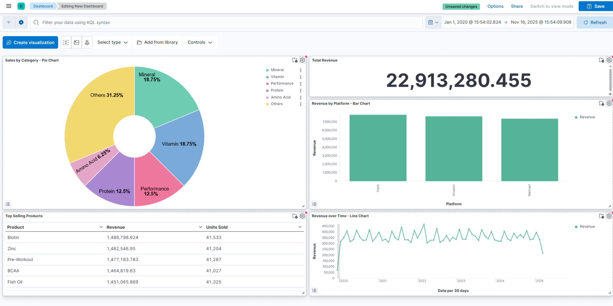

# ELK Stack Sales Dashboard

This proejct demonstrates a complete data pipeline using the ELK Stack (Elasticsearch, Logstash, Kibana). The pipeline ingests a CSV dataset, processes it, and visualizes the data in a dynamic, interactive dashboard.

## Solution Architecture

This project uses the ELK Stack to create a data visualization pipeline:

* **Logstash:** Reads the supplement sales data from a local `dataset.csv` file. it then parses this data, cleans it, and maps the columns to the correct data types (e.g., converting "Revenue" to a float and "Date" to a date object).
* **Elasticsearch:** Receives the structured data from Logstash and stores it in an index named `supplement-sales`.
* **Kibana:** Connects to the Elasticsearch index and provides a user interface to build visualizations and assemble them into a final dashboard.

## The Final Dashboard

The dashboard provides a comprehensive overview of theh supplement sales data.



The dashboard includes the following 5 visualizations:
1. **Metric:** Total Revenue
2. **Pie Chart:** Sales by Category
3. **Bar Chart:** Revenue by Platform
4. **Line Chart:** Revenue over Time
5. **Data Table:** Top Selling Products by Revenue and Units Sold

## How to Set Up

This project is built using Docker and is very simple to run.

1. **Prerequisites:** You must have **Docker Desktop** installed and running on your machine.
2. **Get the Dataset:** 
    * This project requires the **Supplement Sales Dataset**.
    * Download the dataset from this Kaggle link: [Supplement Sales Dataset - Kaggle](https://www.kaggle.com/datasets/zahidmughal2343/supplement-sales-data)
    * Save the file in this project's root directory and **rename it to `dataset.csv`**. (This is necessary for the Logstash pipeline to find it).
3. **Clone the Repository:** Download or clone this repository to your local machine.
4. **Run:** Open a terminal, navigate into the project directory, and run the following commands:
    ```bash
    docker-compose up
    ```
5. **Wait:** This will take several minutes as Docker downloads the images for Elasticsearch, Logstash, and Kibana. Logstash will automatically beign reading the `dataset.csv` file and sending it to Elasticsearch.

## How to Use It

1. **Access Kibana:** Once the services are running, open your web browser and navigate to:
    `https://localhost:5601`
2. **View Dashboard:** The main "Sales Dashboard" will be available. You may need to create Kibana index pattern (`supplement-sales`) and set the time range (e.g., "Last 5 years") to see the data.